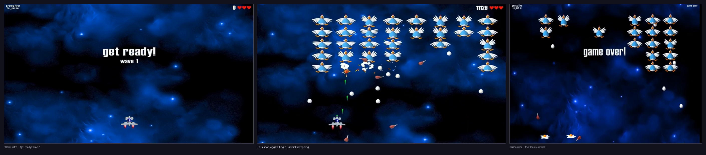
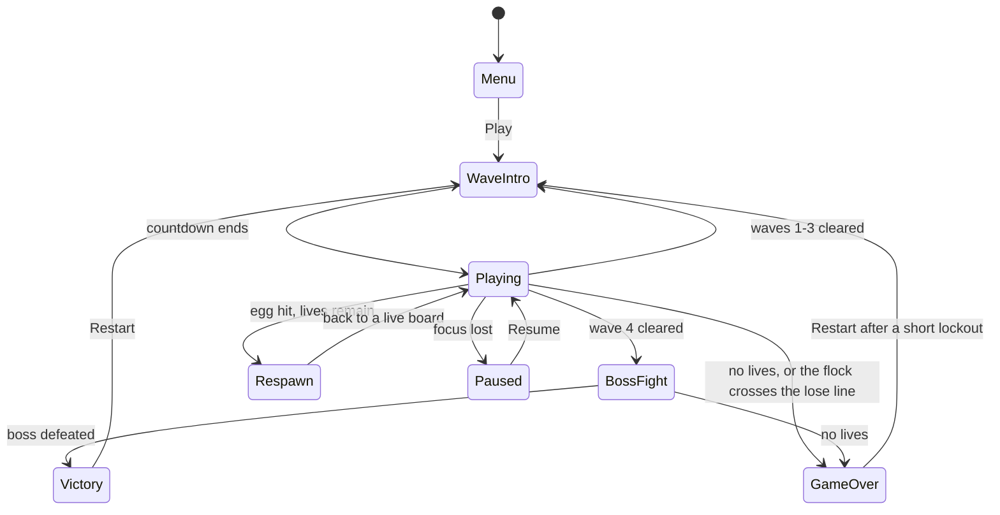
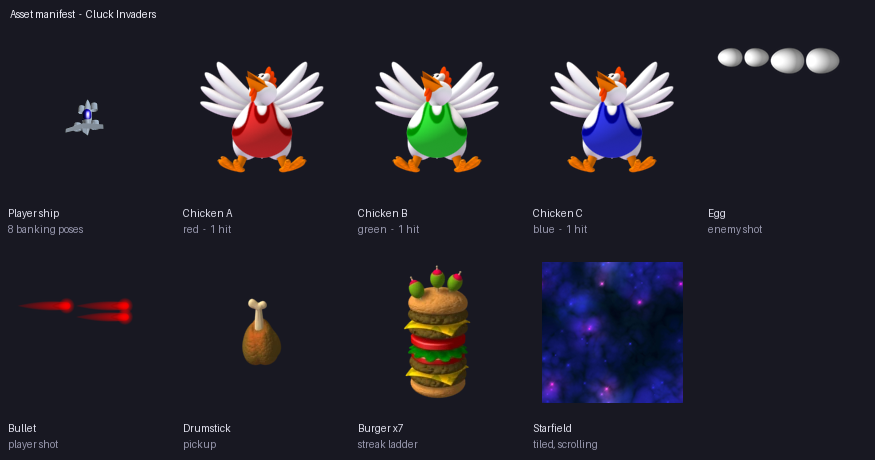
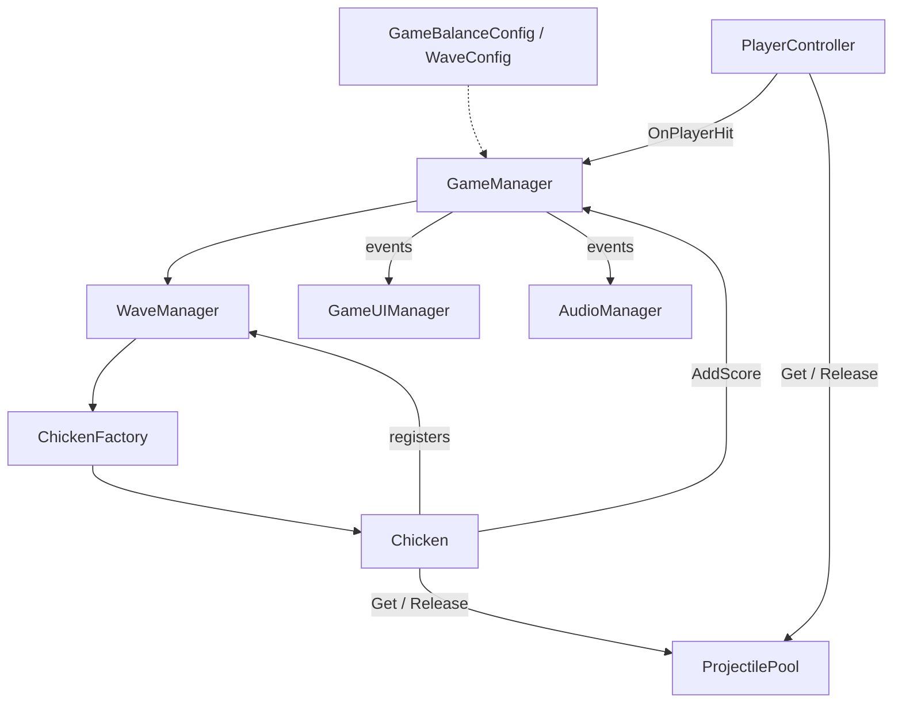

# Game Design Document — *Cluck Invaders*

| | |
|---|---|
| **Working title** | Cluck Invaders |
| **Team** | Ela Shaul — solo: design, programming and asset integration |
| **Genre** | 2D arcade / fixed shooter |
| **Target platforms** | Windows standalone and Android APK |
| **Engine** | Unity 6 (`6000.3.20f1`), URP 2D, Input System |
| **Orientation** | Portrait, 1080 × 1920 reference resolution |
| **Session length** | 3–6 minutes for a full run |
| **Document version** | v1.0 — 2026-09-05 |

A proposal for approval. Numbers below are starting values, not playtest results.

---

## 1. High Concept

A ship pinned to the bottom of the screen moves left and right only. Above it a formation of
chickens drifts sideways, steps down at each wall, and lays eggs. Shoot chickens; each kill makes
the flock faster. An egg costs a life; a chicken past your line ends the run. Clear four waves, then
beat the Mother Hen.

### Design pillars

1. **Clear danger** — the player can always say what hit them. *Rejects:* off-screen attacks, and
   eggs laid so close there is no room to dodge.
2. **Formation-driven pressure** — difficulty comes from the flock descending and speeding up with
   every kill. *Rejects:* time-based speed increases, tougher regular enemies, adaptive difficulty.
3. **Short runs, instant retry** — a run is a few minutes and death to the next attempt is one
   keypress. *Rejects:* level select, mid-run saves, unskippable result screens, loading between
   attempts.

---

## 2. Reference & Inspiration

- **Primary reference:** *Chicken Invaders* by InterAction studios. **Taking:** the chicken-invasion
  theme, falling eggs, food pickups.
- **From Space Invaders:** one formation that reverses at the edges, descends, and gets faster as it
  thins — so the last chicken is the hardest one.
- **Not taking:** a full campaign, weapon shops, multiplayer, or the original title.
- **Video:** [gameplay reference](https://www.youtube.com/watch?v=QSKc-NalxcY).

---

## 3. Core Game Loop

**Moment-to-moment rules**

- **Ship:** three lives, constant speed, clamped to the screen. Holding Fire shoots upward on a
  cooldown. Each bullet does one damage.
- **Formation:** all chickens move as one body. When the outermost surviving chicken touches a wall,
  the whole flock steps down and reverses.
- **Speed:** every kill makes the flock faster. It resets at the next wave — later waves add rows,
  not speed.
- **Eggs:** only the lowest surviving chicken in each column lays them, and it stops once it is too
  close to the player to dodge. **Eggs cannot be shot down** — dodging is the only answer.
- **Scoring:** 100 per chicken, 500 for the boss, 50 for a drumstick. High score saved locally.
- **Failure:** an egg costs one life. The ship vanishes for 1.5 s, then returns at the centre with
  2.5 s of blinking invulnerability. The enemies never pause — you come back to a live board.

### Waves and boss

| Stage | Formation | Completion |
|---|---|---|
| Wave 1 | 2 rows × 5 chickens | Defeat all 10 |
| Wave 2 | 3 rows × 5 | Defeat all 15 |
| Wave 3 | 4 rows × 5 | Defeat all 20 |
| Wave 4 | 5 rows × 5 | Defeat all 25 |
| Mother Hen | One boss, 30 health | Defeat her to win |

The **Mother Hen** sweeps left and right above the lose line and never descends. A health bar shows
what is left of her. At half health she speeds up and switches from aimed three-egg volleys to
dropping eggs continuously along her path, so parking underneath her stops working.

### Parameters to tune

| Parameter | Purpose | First guess |
|---|---|---|
| Ship speed | Horizontal movement | 8 units/s |
| Fire cooldown | Time between shots | 0.18 s |
| Formation speed | Starting speed each wave | 1.5 units/s |
| Speed increase per kill | The difficulty curve | 0.15 units/s |
| Descend step | Drop at each wall | 0.12 units |
| Egg rate | Per eligible chicken | 0.15 eggs/s |
| Egg speed | Reaction time an egg gives | 6 units/s |
| Boss health / volley interval | Length of the boss fight | 30 / 2 s |

**Where these live:** `GameBalanceConfig` and `WaveConfig` ScriptableObjects, so tuning never needs a
recompile.

**Feel target:** a new player clears wave 1 within three attempts; ten minutes of practice reaches
the boss.

---

## 4. Controls & Input

| Action | Keyboard | Gamepad | Android touch |
|---|---|---|---|
| Move | A/D or arrow keys | Left stick | Bottom-left stick |
| Fire | Hold Space | Hold south button | Hold bottom-right button |
| Restart | R on the result screen | East button | Play Again button |

- Input is read every frame and movement applied during physics updates. Releasing stops the ship;
  its sprite leans in the direction of travel.
- Gameplay input is off in menus and during respawn, and a UI press never also fires a shot.
- Game Over ignores Restart for half a second, so the keypress that killed you cannot restart the run.
- Losing focus pauses the game rather than letting the run die.

---

## 5. Screens & UI

1. **Main Menu** — title, Play, high score, control hint, mute toggle.
2. **Wave Intro** — the wave number, centred, before combat starts.
3. **Gameplay** — score and best top-left, wave top-centre, lives top-right. Boss health only during
   the boss fight. Touch controls sit in their own band below the ship.
4. **Game Over / Victory** — result, final score, new-best message, Play Again.
5. **Paused** — Resume over the frozen game.

No minimap, no ammo counter, no timer. The Canvas Scaler uses a 1080 × 1920 reference; HUD elements
are anchored to their own corners, and the layout is checked at several phone aspect ratios.

---

## 6. Art & Audio

| Asset | Use | Source |
|---|---|---|
| Ship, chickens, boss | Player and enemies | Chicken Invaders sprite rips |
| Bullets, eggs, impacts | Combat feedback | Chicken Invaders sprite rips |
| Food | Optional pickups | Chicken Invaders fan wiki |
| Starfield, logo | Background and menu | Chicken Invaders sprite rips |
| Font | Menu and HUD text | To select — record the licence |
| Sound and music | Shots, clucks, impacts, pickups, death, wave clear, looping track | To select — record the licences |

**Licence note.** The artwork is InterAction studios' and carries **no reuse licence**. It is used
for coursework only and is declared as third-party, not presented as original. A public build would
need CC0 replacements — every sprite is referenced through a prefab field, so that is an asset swap,
not a code change. Per-file sources: [ASSETS.md](ASSETS.md).

**Visual rules.** Never stretch a sprite: the background is tiled, not scaled. Point filtering for
sheets, Bilinear for the pre-rendered art. Draw order back to front: background, pickups,
projectiles, chickens, player, effects, UI.

> The chicken sheets import at 160 pixels-per-unit and the ship at 50. At Unity's default of 100 a
> chicken is 1.28 units wide and five columns would be wider than the screen.

---

## 7. Technical Design

**Scene:** one — `Assets/Scenes/SampleScene.unity`. Menus and gameplay share it; restarting resets
state rather than reloading. **Packages:** Input System, Physics2D, URP 2D, Unity UI, TextMeshPro,
`UnityEngine.Pool`. **Demo targets:** Windows and an Android phone.

| System | Responsibility |
|---|---|
| `GameManager` | Score, lives, game state, respawn, restart |
| `PlayerController` | Movement, input, firing |
| `WaveManager` / `ChickenFactory` | Build formations, manage wave progression |
| `Chicken` / `Boss` | Enemy movement, health, attacks |
| `ProjectilePool` / `Projectile` | Reuse bullets and eggs |
| `GameUIManager` / `AudioManager` | Show state and play sound — they own no rules |
| `ScrollingBackground` / `LoseLine` | Background scroll, formation-loss detection |

The shape matters as much as the list: **`GameManager` is the only script that owns the rules.** UI
and audio have arrows pointing into them and none coming out, so they cannot change the score even
by accident. Chickens register themselves with `WaveManager` instead of it searching the scene, so
"is the wave over?" is just "is the list empty?".

### Course concepts

- **Object Pool** — bullets and eggs, because they spawn constantly and `Instantiate` during play
  causes the frame hitches that make a dodging game feel unfair.
- **Coroutines** — wave intros, respawn delay, invulnerability: sequences with a start and an end,
  rather than conditions checked every frame.
- **Singleton** — the managers, via a generic base class, so a dying chicken can reach score, pool
  and audio without a reference threaded through the factory.
- **ScriptableObjects** — balance values and wave layouts as assets, so a new wave is a duplicated
  file rather than an edited component.
- **PlayerPrefs and Gizmos** — the high score; the lose line and formation bounds drawn in the editor.
- **Mobile build** — Android touch controls, tested on a phone.

---

## 8. Scope

### 8.1 Core game

- Horizontal movement, shooting, scrolling background.
- Four chicken formations, egg attacks, and the Mother Hen boss.
- Three lives, respawn protection, scoring, saved high score.
- Menu, HUD, pause, victory and game-over screens, restart.
- Projectile pools, sound effects, music.
- Windows build, and Android touch controls.

### 8.2 Optional polish

- Drumsticks that fall from defeated chickens and award points when collected.
- Hit flashes, feathers, a small screen shake on death.
- Boss music and animated menu transitions.

### 8.3 Out of scope

- Extra levels or a campaign beyond four waves and the boss.
- Weapon upgrades, shops, combo systems.
- Multiplayer, online leaderboards, accounts.
- Saving anything beyond the local high score.
- iOS, localisation, selectable difficulty.

**Risks:** the boss attacks need playtesting, mobile controls must not cover the ship or the eggs,
and the artwork licence needs the lecturer's acceptance. The idea and this document need approval
before full production.

---

## Changelog

| Version | Date | Change |
|---|---|---|
| v1.0 | 2026-09-05 | Initial proposal, written before implementation |
