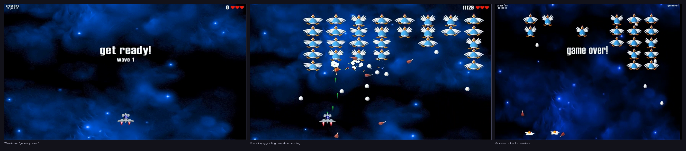
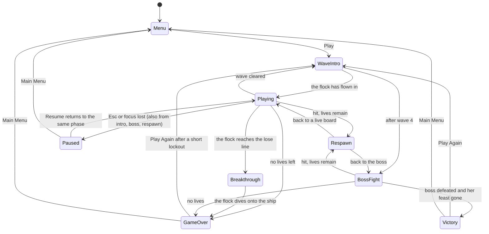
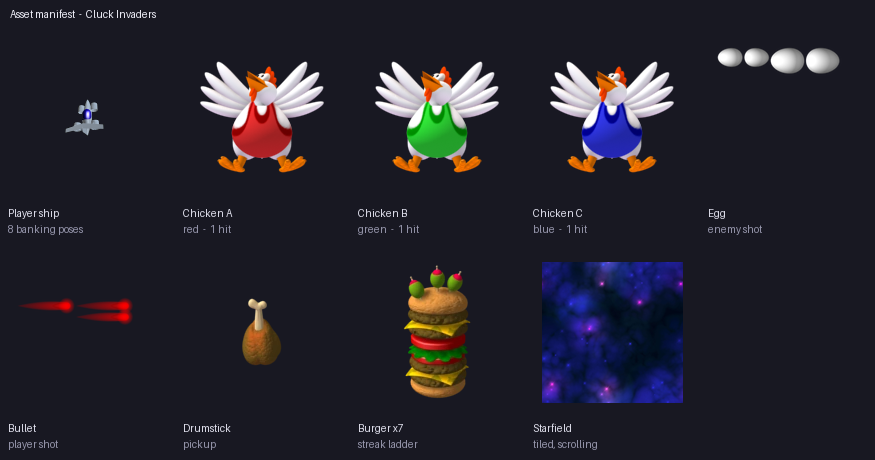
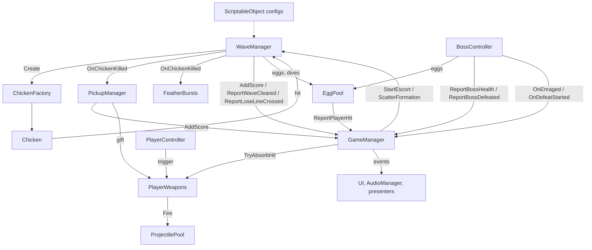

# Game Design Document — *Cluck Invaders*

| | |
|---|---|
| **Working title** | Cluck Invaders |
| **Team** | Ela Shaul — solo: design, programming and asset integration |
| **Genre** | 2D arcade / fixed shooter |
| **Target platforms** | PC — Windows standalone only |
| **Engine** | Unity 6 (`6000.3.20f1`), URP 2D, Input System |
| **Orientation** | Landscape PC window, 1920 × 1080 reference resolution |
| **Session length** | 3–6 minutes for a full run |
| **Document version** | v1.16 — 2026-10-05 |

The numbers below have been tuned by playtesting; most live in config assets, with a few (ship speed, bank response) as Inspector fields on their component.

**Status (2026-10-04):** complete and playable — four waves with dive bombers, the lose line, the
two-phase Mother Hen with her chick escort and defeat feast, the Feast Streak, gift weapons and the
shield, music and sound, a menu with How To Play and an attract mode, pause, Game Over, Victory and
restart, and a Windows build.

---

## 1. High Concept

A ship pinned to the bottom of the screen moves left and right only. Above it a formation of
chickens drifts sideways, steps down at each wall, and lays eggs. Shoot chickens; each kill makes
the flock faster. An egg costs a life; a chicken past your line ends the run. Clear four waves, then
beat the Mother Hen.

### Design pillars

1. **Clear danger** — the player can always say what hit them. *Rejects:* off-screen attacks, and
   eggs laid so close there is no room to dodge.
2. **Formation-driven pressure** — difficulty comes from the flock: it descends, speeds up with every
   kill, starts each later wave faster, and sends warned dive bombers out of its ranks. *Rejects:*
   time-based speed increases, tougher regular enemies, adaptive difficulty.
3. **Short runs, instant retry** — a run is a few minutes and death to the next attempt is one
   keypress. *Rejects:* level select, mid-run saves, unskippable result screens, loading between
   attempts.

---

## 2. Reference & Inspiration

- **Primary reference:** *Chicken Invaders* by InterAction studios. **Taking:** the chicken-invasion
  theme, falling eggs, food pickups.
- **From Space Invaders:** one formation that reverses at the edges, descends, and gets faster as it
  thins — so the last chicken is the hardest one.
- **Not taking:** a full campaign, weapon shops, multiplayer, or the original title.
- **Video:** [gameplay reference](https://www.youtube.com/watch?v=QSKc-NalxcY).

---

## 3. Core Game Loop

```mermaid
stateDiagram-v2
    [*] --> Menu
    Menu --> WaveIntro: Play
    WaveIntro --> Playing: the flock has flown in
    Playing --> WaveIntro: wave cleared
    WaveIntro --> BossFight: after wave 4
    Playing --> Respawn: hit, lives remain
    BossFight --> Respawn: hit, lives remain
    Respawn --> Playing: back to a live board
    Respawn --> BossFight: back to the boss
    BossFight --> Victory: boss defeated and her feast gone
    Playing --> GameOver: no lives left
    Playing --> Breakthrough: the flock reaches the lose line
    Breakthrough --> GameOver: the flock dives onto the ship
    BossFight --> GameOver: no lives
    Playing --> Paused: Esc or focus lost (also from intro, boss, respawn)
    Paused --> Playing: Resume returns to the same phase
    Paused --> Menu: Main Menu
    GameOver --> WaveIntro: Play Again after a short lockout
    Victory --> WaveIntro: Play Again
    GameOver --> Menu: Main Menu
    Victory --> Menu: Main Menu
```

**Moment-to-moment rules**

- **Ship:** three lives, constant speed, clamped to the screen. Holding Fire shoots upward on a
  cooldown. Each default bullet does one damage (gift weapons differ — see below).
- **Gifts:** now and then a kill also drops a gift box (a 3% chance per kill, never two at once,
  and at the latest after a random 10–18 kills). Catching it gives 8 s of **Spread** (3-way shot),
  **Lightning** (rapid bolts that pierce through chickens) or **Fireball** (slow, 3 damage), or a
  **Shield** bubble for 12 s that absorbs one hit. Contents come from a shuffled bag, so every item
  appears before any repeats and each run differs. Getting hit ends a gift weapon; a shield is spent
  instead of a life and followed by 1 s of protection.
- **Formation:** all chickens move as one body. When the outermost surviving chicken touches a wall,
  the whole flock steps down and reverses.
- **Speed:** every kill makes the flock faster. It resets at the next wave, and each later wave
  starts faster, steps down further and lays more, quicker eggs (values per wave in its WaveConfig).
- **Dive bombers:** from wave 2 a chicken now and then wobbles as a warning, then leaves the
  formation and swoops through the ship's lane, dropping one aimed egg. It flies off the bottom and
  back into its slot. Touching a diver costs a life; shooting one mid-dive drops its food close by.
- **Eggs:** only the lowest surviving chicken in each column lays them, as in Space Invaders, and a
  low flock keeps laying all the way down. The one exception keeps it fair: a chicken less than 2.5
  units above the ship *and* less than 1.5 units to its side stays silent, because its egg could not
  be dodged. **Eggs cannot be shot down** — dodging is the only answer.
- **Scoring:** 100 per chicken, 500 for the boss, plus the food you catch (below). High score saved
  locally.
- **Feast Streak:** every chicken drops food. A kill within 1.2 s of the previous one raises the
  streak, and the streak decides the food: drumstick (50) → twin legs (100) → roast (200) → a
  burger that grows taller with every extra kill, from a plain burger (300) to the quad burger
  (1500). Food falls through the same air as the eggs, so chasing it is a risk for a reward; it
  never hurts. It bounces off the screen sides, bounces once on the floor, rests there for 2.5 s and
  blinks before it vanishes. A rare red herring is worth nothing. Getting hit resets the streak.
- **Lose line:** if the flock's lowest chicken reaches the line just above the ship, the run is lost
  whatever lives remain. It is shown, not just announced: controls lock, the music cuts to a siren,
  the whole flock dives onto the ship, and the ship explodes with a red flash, a heavy shake and a
  big boom before Game Over ("THE FLOCK BROKE THROUGH!").
- **Failure:** an egg, or touching a diving chicken, costs one life. The ship vanishes for 1.5 s, then returns at the centre with
  2.5 s of blinking invulnerability. The enemies never pause — you come back to a live board.

### Waves and boss

| Stage | Formation | Start speed / egg rate | Dive bombers | Completion |
|---|---|---|---|---|
| Wave 1 | 2 rows × 5 chickens | 1.5 / 0.15 | — | Defeat all 10 |
| Wave 2 | 3 rows × 5 | 1.8 / 0.20 | one at a time, ~7 s apart | Defeat all 15 |
| Wave 3 | 4 rows × 5 | 2.1 / 0.25 | up to two, ~5 s apart | Defeat all 20 |
| Wave 4 | 5 rows × 5 | 2.4 / 0.30 | up to two, ~3.5 s apart, faster | Defeat all 25 |
| Mother Hen | One boss, 75 health | — | chick escort at half health | Defeat her to win |

The **Mother Hen** sweeps left and right above the lose line and never descends. A health bar shows
what is left of her. In the first phase she fires aimed five-egg volleys after a short warning.
At half health she speeds up and switches to dropping eggs continuously along her path, so parking
underneath her stops working, and she calls a row of four chicks that sweep below her, shield her
and dive-bomb the ship (shooting them scores and drops food). In both phases she regularly pauses,
charges and fires a ring of nine eggs fanned downwards, so the player must find the gap.
Her armour shows the damage: the glass helmet cracks after she loses a third of her health, and
the armour is gone for the last third. Her defeat is a short show: she swells, shakes and pops with
small blasts, then disappears in one big explosion before the Victory screen. She throws out a
feast of roasts and burgers while she goes, and Victory waits until every piece has been caught or has vanished.

Her entrance, half-health change and defeat receive short camera cues. The view briefly pulls back
and settles with gentle shake; normal combat keeps a fixed view. The extra view margin preserves
edge visibility. Entrance plays once per run, including across pause and respawn. Durations and
strengths are configured in GameBalance, and zero duration disables an individual cue.

### Parameters to tune

| Parameter | Purpose | First guess |
|---|---|---|
| Ship speed | Horizontal movement | 8 units/s |
| Fire cooldown | Time between shots | 0.18 s |
| Formation speed / speed per kill / step down / egg rate | Per wave, in each WaveConfig | see the wave table |
| Egg speed | Reaction time an egg gives | 6 units/s, times a per-wave multiplier |
| Gift weapon / shield duration | How long a gift helps | 8 s / 12 s |
| Boss health / volley interval / ring burst | Length of the boss fight | 75 / 1.5 s / every 6 s |

**Where these live:** mostly ScriptableObjects — `GameBalance`, the five `WaveConfig` assets (four waves
and the boss escort), `MotherHen`, `Food`, `Gifts`, the four weapons and `Audio` — so tuning rarely needs
a recompile. Ship speed and bank response are `[SerializeField]` fields on `PlayerController`.

**Feel target:** a new player clears wave 1 within three attempts; ten minutes of practice reaches
the boss.

---

## 4. Controls & Input

| Action | Keyboard | Gamepad |
|---|---|---|
| Move | A/D or arrow keys | Left stick or D-pad |
| Fire | Hold Space | Hold south button |
| Restart | R on the result screen | East button |
| Pause / resume | Escape | Start button |
| Mute / unmute | M | Select button |

- Input is read every frame and movement applied during physics updates. Releasing stops the ship;
  its sprite leans in the direction of travel.
- Gameplay input is off in menus and during respawn, and a UI press never also fires a shot.
- Between waves the ship can move and collect food, but cannot shoot.
- Game Over ignores Restart for half a second, so the keypress that killed you cannot restart the run.
- Losing focus pauses the game rather than letting the run die.

---

## 5. Screens & UI

1. **Main Menu** — floating title, Play, How To Play, Quit, high score, control hint. M (or gamepad
   Select) mutes, and is remembered. Behind it, a flock of decorative chickens drifts and swoops and
   Mother Hen glides past now and then (an attract mode); it vanishes when a run starts.
2. **How To Play** — controls and rules, the Feast Streak food ladder and the gift contents. The
   ladder and gifts are built from the real Food, Gifts and weapon configs, so they always match.
3. **Wave Intro** — the wave number, centred, before combat starts.
4. **Gameplay** — score and best top-left, wave top-centre, lives top-right. During the boss fight her
   health is a vertical bar on the right edge, so it never covers her.
5. **Game Over / Victory** — result, the reason for a Game Over ("OUT OF LIVES" or "THE FLOCK BROKE
   THROUGH!"), final score, personal best, Play Again and Main Menu.
6. **Paused** — Resume or Main Menu over the frozen game, with the music muffled.

No minimap, no ammo counter, no timer. The camera and Screen Space – Overlay Canvas fill the window.
Canvas Scaler uses Scale With Screen Size, a 1920 × 1080 reference and Expand; HUD elements are
anchored to the window edges. The tiled starfield is a child of the camera and expands to cover its
view, with extra coverage for scrolling and camera cues. Player, flock and boss bounds follow the
camera viewport, so wider windows provide more horizontal space. There is no fixed-aspect frame.

---

## 6. Art & Audio

| Asset | Use | Source |
|---|---|---|
| Ship, chickens, boss | Player and enemies | Chicken Invaders sprite rips |
| Bullets, eggs, impacts | Combat feedback | Chicken Invaders sprite rips |
| Food | Feast Streak pickups: legs, roast, seven burgers, red herring | Chicken Invaders fan wiki |
| Starfield, logo | Background and menu | Chicken Invaders sprite rips |
| Font | Menu and HUD text | Bungee from Google Fonts — SIL OFL 1.1 |
| Sound and music | Shots, clucks, eggs, explosions, boss cues, UI, menu/wave/boss/victory music | Kenney and OpenGameArt — CC0, chicken CC-BY 3.0 (see ASSETS.md) |

**Licence note.** The artwork is InterAction studios' and carries **no reuse licence**. It is used
for coursework only and is declared as third-party, not presented as original. A public build would
need CC0 replacements — every sprite is referenced through a prefab field, so that is an asset swap,
not a code change. Per-file sources: [ASSETS.md](ASSETS.md).

**Visual rules.** Never stretch a sprite: the background is tiled, not scaled. Point filtering for
sheets, Bilinear for the pre-rendered art. Draw order back to front: background, pickups,
projectiles, chickens, player, effects, UI.

> Sprites import at 100 pixels-per-unit, except the ship (40) and the pixel-art gift box (40, Point
> filter). A chicken is then 1.28 units wide, so five columns at 1.35 units apart fit the 17.8-unit
> wide 16:9 view with room to sweep.

---

## 7. Technical Design

**Scene:** one — `Assets/Scenes/SampleScene.unity`. Menus and gameplay share it; restarting resets
state rather than reloading. **Packages:** Input System, Physics2D, URP 2D, Unity UI, TextMeshPro,
`UnityEngine.Pool`. **Demo target:** Windows PC only.

```mermaid
flowchart TD
    Configs[ScriptableObject configs] -.-> WaveManager
    WaveManager -->|Create| ChickenFactory --> Chicken
    Chicken -->|hit| WaveManager
    WaveManager -->|OnChickenKilled| PickupManager
    WaveManager -->|OnChickenKilled| FeatherBursts
    WaveManager -->|AddScore / ReportWaveCleared / ReportLoseLineCrossed| GameManager
    Player[PlayerController] -->|trigger| Weapons[PlayerWeapons] -->|Fire| Bullets[ProjectilePool]
    WaveManager -->|eggs, dives| Eggs[EggPool]
    Boss[BossController] -->|eggs| Eggs
    Eggs -->|ReportPlayerHit| GameManager
    GameManager -->|TryAbsorbHit| Weapons
    PickupManager -->|AddScore| GameManager
    PickupManager -->|gift| Weapons
    Boss -->|ReportBossHealth / ReportBossDefeated| GameManager
    Boss -->|OnEnraged / OnDefeatStarted| GameManager -->|StartEscort / ScatterFormation| WaveManager
    GameManager -->|events| Listeners[UI, AudioManager, presenters]
```

The scene has one `Managers` object holding `GameManager`, `WaveManager`, `ChickenFactory`,
`ProjectilePool`, `EggPool`, `PickupManager`, `PlayerDeathPresenter` and `AudioManager` (with its
`Music` and `Effects` children). The UI (`RunUI`), Mother Hen and the menu's `MenuAttract` are
prefabs placed in the scene; chickens, bullets, eggs and pickups are instantiated from prefabs.

| System | Responsibility |
|---|---|
| `GameManager` (`IGameManager`) | Run state, score, lives, respawn, shield rule, pause, win/lose, restart |
| `PlayerController` / `PlayerWeapons` | Input and movement / current weapon, gift timer, shield, firing patterns |
| `WaveManager` / `ChickenFactory` / `Chicken` | Formations and escort: building, sweeping, lose line, kills, wave completion |
| `FormationEntry` / `FormationEggs` / `ChickenDives` / `FlockBreakthrough` | Helpers owned by WaveManager: the fly-in, who lays eggs and when, the dive bombers, the final charge at the lose line |
| `BossController` / `BossPresenter` | Mother Hen's rules, attacks and feast / her animation, damage looks and defeat show |
| `ProjectilePool` / `EggPool` / `PickupManager` | Bullets, eggs, and food and gifts — each owns a `TrackedPool<T>` |
| `AudioManager` | Music per run state with crossfades; one-shots by name (`SoundEffect`) |
| `GameUIManager`, `FeastPresenter`, `LoadoutPresenter`, `HowToPlayPresenter` | Menus, HUD, boss bar, streak and popups, weapon timer, instructions |
| `FeatherBursts`, `ExplosionEffect`, `PlayerDeathPresenter`, `CameraFeedback`, `ImpactFlash` | Visual feedback only |
| `ScrollingBackground`, `MenuAttract` | Camera-child starfield covering the full view, the menu's living background |

Scripts are grouped by role: `Core` (singleton base, interfaces, `TrackedPool`, constants),
`Config` (ScriptableObject types), `Managers` (scene systems), `Gameplay` (objects with rules),
`Effects` (visual only) and `UI`. Everything not made for this project is under
`Assets/ThirdParty`.

The shape matters as much as the list: **`GameManager` is the only script that owns the rules.**
Other systems *report* what happened (`ReportPlayerHit`, `ReportWaveCleared`, …) and GameManager
decides what it means for the run; the UI, audio and presenters only listen to its events. A kill
is announced once by `WaveManager.OnChickenKilled`, and food and feathers react to it. Chickens are
tracked by `WaveManager` when it creates them instead of searching the scene, so "is the wave over?"
is just "is the set empty?". `AudioManager` follows the same rule: music follows GameManager's
state events, and gameplay code only asks for a sound by name.

**Audio design.** Each part of the run has its own track (menu, waves, boss, victory), crossfaded.
The boss gets silence and a siren before her track, a charge-up sound that warns of every volley,
a glass shatter when her helmet cracks, and a chain of blasts ending in a big boom that briefly
ducks the music. Pausing muffles the music with a low-pass filter instead of stopping it. Repeated
sounds get small random pitch changes, and bursts (egg splats) are rate-limited.

### Course concepts

- **Object Pool** — bullets, eggs and pickups, because they spawn constantly and `Instantiate` during
  play causes the frame hitches that make a dodging game feel unfair. Each owner wraps Unity's
  `ObjectPool<T>` in one shared `TrackedPool<T>` (composition), which also releases everything at a
  restart and makes a second release harmless. The feather burst is a particle system emitting at
  any point, so it is its own pool.
- **Coroutines** — wave advance, respawn delay, protection, screen fades, music crossfades and
  result cues: sequences with a start and an end, rather than conditions checked every frame.
- **Singleton** — a generic `Singleton<T>` base for the four objects that many scripts need:
  `GameManager`, `PlayerController`, `AudioManager` and `FeatherBursts`. Everything else gets
  references from the Inspector or is passed in by its owner.
- **Observer** — managers broadcast events (`IGameManagerEvents`, `OnChickenKilled`, `OnEnraged`,
  weapon and shield changes) and listeners unsubscribe in `OnDestroy`.
- **Factory** — `ChickenFactory` builds configured chickens; it knows nothing about score or waves.
- **Enum-keyed sounds** — the lecturer's SoundManager idea: `AudioManager.Play(SoundEffect.Shoot)`,
  with clips and volumes in an `Audio` ScriptableObject instead of `Resources.Load`.
- **Interface** — `IGameManager` (with `IGameManagerEvents`) is the readable contract of what the
  rest of the game may ask of the run; other scripts depend on it, not on the concrete class.
- **ScriptableObjects** — balance values, waves, the boss, food, gifts, weapons and audio as assets,
  so a new wave or weapon is a duplicated file rather than new code.
- **State** — `GameState` decides what may happen when (`CanControlPlayer`, `CanMovePlayer`,
  `CanDamagePlayer`…); Mother Hen and the dive bombers each run a small phase machine.
- **PlayerPrefs and Gizmos** — the high score; the lose line, formation origin and ship lane drawn
  in the Scene view.

---

## 8. Scope

### 8.1 Core game

- Horizontal movement, shooting, scrolling background.
- Four chicken formations, egg attacks, and the Mother Hen boss.
- Three lives, respawn protection, scoring, saved high score.
- Menu, HUD, pause, victory and game-over screens, restart.
- Projectile and food pools, sound effects, music.
- Feast Streak food pickups and Mother Hen's feast.
- Feather bursts and a short pop when a chicken dies; feathers on every boss hit.
- Gift weapons (Spread, Lightning, Fireball) and the shield.
- Boss music, faded screen transitions, How To Play and the attract-mode menu.
- Windows standalone build.

### 8.2 Optional polish

- A small screen shake when the player dies (the boss already has camera cues).

### 8.3 Out of scope

- Extra levels or a campaign beyond four waves and the boss.
- Permanent weapon upgrades and shops; combo systems beyond the Feast Streak.
- Multiplayer, online leaderboards, accounts.
- Saving anything beyond the local high score and the mute setting.
- Localisation, selectable difficulty.

**Risks:** the artwork is ripped from Chicken Invaders and Starbound and has no reuse licence; it is
declared as coursework-only third-party art (see ASSETS.md), and a public release would need
replacements.

---

## Changelog

| Version | Date | Change |
|---|---|---|
| v1.16 | 2026-10-05 | Replaced fixed-aspect letterboxing with a full-window camera and camera-child tiled background that resizes with the view; full-window responsive Canvas; loadout accommodates weapon and shield lines |
| v1.15 | 2026-10-05 | Doc fixes: state diagram routes wave 4 through WaveIntro to the boss; boss row fills all wave-table columns; changelog ordered newest-first; clarified default-bullet damage and that ship speed / bank response are Inspector fields; ASSETS corrected (not every sprite is from Chicken Invaders, food PPU 100, hero_ship original not kept, removed food marked historical) |
| v1.13 | 2026-10-05 | A low flock keeps laying eggs from the sides; only chickens close and directly above the ship stay silent |
| v1.12 | 2026-10-04 | Lose line shown as a breakthrough (flock dives onto the ship, red flash, shake, boom) with a Game Over reason; Mother Hen's health bar now visibly empties and changes colour |
| v1.11 | 2026-10-04 | GDD checked line by line against the game: state diagram, controls (mute, D-pad, between-wave movement), result and pause screens, import sizes, scope and risks corrected; food now bounces off the screen sides |
| v1.10 | 2026-10-01 | Clean-up: shared TrackedPool, WaveManager split into helpers, scripts grouped into Core/Config/Managers/Gameplay/Effects/UI, third-party assets moved to Assets/ThirdParty, unused art removed, Quit button |
| v1.9 | 2026-10-01 | Menu: How To Play screen, attract-mode flock behind the title, fade-in screen transitions and a floating logo |
| v1.8 | 2026-10-01 | Gift boxes with 8 s weapons (Spread, Lightning, Fireball) and a 12 s one-hit shield, from a shuffled bag; weapons are WeaponConfig assets; Mother Hen raised to 75 health to balance them |
| v1.7 | 2026-10-01 | Tougher Mother Hen: 45 health, five-egg volleys, ring bursts and a diving chick escort at half health |
| v1.6 | 2026-10-01 | Each wave has its own difficulty; dive bombers from wave 2 — the earlier "later waves add rows, not speed" rule is dropped because playtests found the waves too easy |
| v1.5 | 2026-10-01 | Feather particle bursts and chicken death pop; chicken kills are now an event that food and effects listen to |
| v1.4 | 2026-10-01 | Feast Streak food pickups and Mother Hen's feast; a streak-based reward moved into scope |
| v1.3 | 2026-10-01 | Music and sound effects with mute; lose line implemented; 16:9 letterbox; bigger Mother Hen with damage looks, side health bar and a defeat show; UI and Mother Hen moved into scene prefabs; fixed orientation, font and system list to match the game; audio kept as the next major pass |
| v1.2 | 2026-09-30 | Added explicit run states and manual pause/resume controls; documented the prototype interface and remaining gameplay work |
| v1.1 | 2026-09-26 | Defined Windows PC as the sole target platform; updated controls, UI validation, technical design and scope accordingly |
| v1.0 | 2026-09-05 | Initial proposal, written before implementation |
