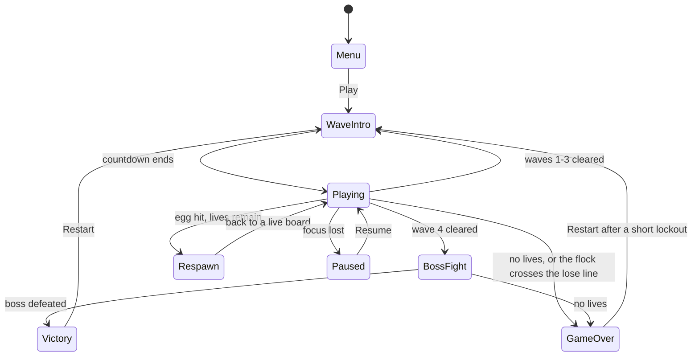
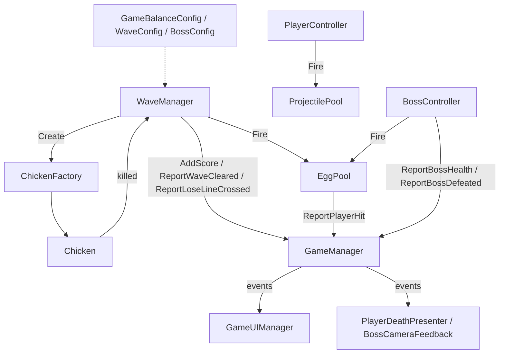

# Game Design Document — *Cluck Invaders*

| | |
|---|---|
| **Working title** | Cluck Invaders |
| **Team** | Ela Shaul — solo: design, programming and asset integration |
| **Genre** | 2D arcade / fixed shooter |
| **Target platforms** | PC — Windows standalone only |
| **Engine** | Unity 6 (`6000.3.20f1`), URP 2D, Input System |
| **Orientation** | Landscape PC window, 1920 × 1080 reference resolution |
| **Session length** | 3–6 minutes for a full run |
| **Document version** | v1.3 — 2026-10-01 |

A proposal for approval. Numbers below are starting values, not playtest results.

**Status (2026-10-01):** the full loop is playable — four waves, the lose line, the two-phase
Mother Hen with a health bar, respawn, pause, Game Over, Victory and restart, with music and sound
effects, and the Feast Streak food pickups.

---

## 1. High Concept

A ship pinned to the bottom of the screen moves left and right only. Above it a formation of
chickens drifts sideways, steps down at each wall, and lays eggs. Shoot chickens; each kill makes
the flock faster. An egg costs a life; a chicken past your line ends the run. Clear four waves, then
beat the Mother Hen.

### Design pillars

1. **Clear danger** — the player can always say what hit them. *Rejects:* off-screen attacks, and
   eggs laid so close there is no room to dodge.
2. **Formation-driven pressure** — difficulty comes from the flock descending and speeding up with
   every kill. *Rejects:* time-based speed increases, tougher regular enemies, adaptive difficulty.
3. **Short runs, instant retry** — a run is a few minutes and death to the next attempt is one
   keypress. *Rejects:* level select, mid-run saves, unskippable result screens, loading between
   attempts.

---

## 2. Reference & Inspiration

- **Primary reference:** *Chicken Invaders* by InterAction studios. **Taking:** the chicken-invasion
  theme, falling eggs, food pickups.
- **From Space Invaders:** one formation that reverses at the edges, descends, and gets faster as it
  thins — so the last chicken is the hardest one.
- **Not taking:** a full campaign, weapon shops, multiplayer, or the original title.
- **Video:** [gameplay reference](https://www.youtube.com/watch?v=QSKc-NalxcY).

---

## 3. Core Game Loop

```mermaid
stateDiagram-v2
    [*] --> Menu
    Menu --> WaveIntro: Play
    WaveIntro --> Playing: countdown ends
    Playing --> WaveIntro: waves 1-3 cleared
    Playing --> BossFight: wave 4 cleared
    Playing --> Respawn: egg hit, lives remain
    Respawn --> Playing: back to a live board
    BossFight --> Victory: boss defeated
    Playing --> GameOver: no lives, or the flock crosses the lose line
    BossFight --> GameOver: no lives
    Playing --> Paused: focus lost
    Paused --> Playing: Resume
    GameOver --> WaveIntro: Restart after a short lockout
    Victory --> WaveIntro: Restart
```

**Moment-to-moment rules**

- **Ship:** three lives, constant speed, clamped to the screen. Holding Fire shoots upward on a
  cooldown. Each bullet does one damage.
- **Gifts:** now and then a kill also drops a gift box (a 3% chance per kill, never two at once,
  and at the latest after a random 10–18 kills). Catching it gives 8 s of **Spread** (3-way shot),
  **Lightning** (rapid bolts that pierce through chickens) or **Fireball** (slow, 3 damage), or a
  **Shield** bubble for 12 s that absorbs one hit. Contents come from a shuffled bag, so every item
  appears before any repeats and each run differs. Getting hit ends a gift weapon; a shield is spent
  instead of a life and followed by 1 s of protection.
- **Formation:** all chickens move as one body. When the outermost surviving chicken touches a wall,
  the whole flock steps down and reverses.
- **Speed:** every kill makes the flock faster. It resets at the next wave, and each later wave
  starts faster, steps down further and lays more, quicker eggs (values per wave in its WaveConfig).
- **Dive bombers:** from wave 2 a chicken now and then wobbles as a warning, then leaves the
  formation and swoops through the ship's lane, dropping one aimed egg. It flies off the bottom and
  back into its slot. Touching a diver costs a life; shooting one mid-dive drops its food close by.
- **Eggs:** only the lowest surviving chicken in each column lays them, and it stops once it is too
  close to the player to dodge. **Eggs cannot be shot down** — dodging is the only answer.
- **Scoring:** 100 per chicken, 500 for the boss, plus the food you catch (below). High score saved
  locally.
- **Feast Streak:** every chicken drops food. A kill within 1.2 s of the previous one raises the
  streak, and the streak decides the food: drumstick (50) → twin legs (100) → roast (200) → a
  burger that grows taller with every extra kill, from a plain burger (300) to the quad burger
  (1500). Food falls through the same air as the eggs, so chasing it is a risk for a reward; it
  never hurts. It bounces once, rests on the floor for 2.5 s and blinks before it vanishes. A
  rare red herring is worth nothing. Getting hit resets the streak.
- **Failure:** an egg costs one life. The ship vanishes for 1.5 s, then returns at the centre with
  2.5 s of blinking invulnerability. The enemies never pause — you come back to a live board.

### Waves and boss

| Stage | Formation | Start speed / egg rate | Dive bombers | Completion |
|---|---|---|---|---|
| Wave 1 | 2 rows × 5 chickens | 1.5 / 0.15 | — | Defeat all 10 |
| Wave 2 | 3 rows × 5 | 1.8 / 0.20 | one at a time, ~7 s apart | Defeat all 15 |
| Wave 3 | 4 rows × 5 | 2.1 / 0.25 | up to two, ~5 s apart | Defeat all 20 |
| Wave 4 | 5 rows × 5 | 2.4 / 0.30 | up to two, ~3.5 s apart, faster | Defeat all 25 |
| Mother Hen | One boss, 75 health, chick escort at half health | Defeat her to win |

The **Mother Hen** sweeps left and right above the lose line and never descends. A health bar shows
what is left of her. In the first phase she fires aimed five-egg volleys after a short warning.
At half health she speeds up and switches to dropping eggs continuously along her path, so parking
underneath her stops working, and she calls a row of four chicks that sweep below her, shield her
and dive-bomb the ship (shooting them scores and drops food). In both phases she regularly pauses,
charges and fires a ring of nine eggs fanned downwards, so the player must find the gap.
Her armour shows the damage: the glass helmet cracks after she loses a third of her health, and
the armour is gone for the last third. Her defeat is a short show: she swells, shakes and pops with
small blasts, then disappears in one big explosion before the Victory screen. She throws out a
feast of roasts and burgers while she goes, and Victory waits until every piece has been caught or has vanished.

Her entrance, half-health change and defeat receive short camera cues. The view briefly pulls back
and settles with gentle shake; normal combat keeps a fixed view. The extra view margin preserves
edge visibility. Entrance plays once per run, including across pause and respawn. Durations and
strengths are configured in GameBalance, and zero duration disables an individual cue.

### Parameters to tune

| Parameter | Purpose | First guess |
|---|---|---|
| Ship speed | Horizontal movement | 8 units/s |
| Fire cooldown | Time between shots | 0.18 s |
| Formation speed | Starting speed each wave | 1.5 units/s |
| Speed increase per kill | The difficulty curve | 0.15 units/s |
| Descend step | Drop at each wall | 0.12 units |
| Egg rate | Per eligible chicken | 0.15 eggs/s |
| Egg speed | Reaction time an egg gives | 6 units/s |
| Boss health / volley interval / ring burst | Length of the boss fight | 75 / 1.5 s / every 6 s |

**Where these live:** `GameBalanceConfig` and `WaveConfig` ScriptableObjects, so tuning never needs a
recompile.

**Feel target:** a new player clears wave 1 within three attempts; ten minutes of practice reaches
the boss.

---

## 4. Controls & Input

| Action | Keyboard | Gamepad |
|---|---|---|
| Move | A/D or arrow keys | Left stick |
| Fire | Hold Space | Hold south button |
| Restart | R on the result screen | East button |
| Pause / resume | Escape | Start button |

- Input is read every frame and movement applied during physics updates. Releasing stops the ship;
  its sprite leans in the direction of travel.
- Gameplay input is off in menus and during respawn, and a UI press never also fires a shot.
- Game Over ignores Restart for half a second, so the keypress that killed you cannot restart the run.
- Losing focus pauses the game rather than letting the run die.

---

## 5. Screens & UI

1. **Main Menu** — floating title, Play, How To Play, high score, control hint. M (or gamepad
   Select) mutes, and is remembered. Behind it, a flock of decorative chickens drifts and swoops and
   Mother Hen glides past now and then (an attract mode); it vanishes when a run starts.
2. **How To Play** — controls and rules, the Feast Streak food ladder and the gift contents. The
   ladder and gifts are built from the real Food, Gifts and weapon configs, so they always match.
3. **Wave Intro** — the wave number, centred, before combat starts.
4. **Gameplay** — score and best top-left, wave top-centre, lives top-right. During the boss fight her
   health is a vertical bar on the right edge, so it never covers her.
5. **Game Over / Victory** — result, final score, new-best message, Play Again.
6. **Paused** — Resume over the frozen game.

No minimap, no ammo counter, no timer. The Canvas Scaler uses a 1920 × 1080 reference; HUD elements
are anchored to their own corners. The gameplay view is letterboxed to 16:9: any other window shape
gets black bars instead of a wider or narrower world, so the formation, ship lane and boss path are
the same at every resolution.

---

## 6. Art & Audio

| Asset | Use | Source |
|---|---|---|
| Ship, chickens, boss | Player and enemies | Chicken Invaders sprite rips |
| Bullets, eggs, impacts | Combat feedback | Chicken Invaders sprite rips |
| Food | Feast Streak pickups: legs, roast, seven burgers, red herring | Chicken Invaders fan wiki |
| Starfield, logo | Background and menu | Chicken Invaders sprite rips |
| Font | Menu and HUD text | Bungee from Google Fonts — SIL OFL 1.1 |
| Sound and music | Shots, clucks, eggs, explosions, boss cues, UI, menu/wave/boss/victory music | Kenney and OpenGameArt — CC0, chicken CC-BY 3.0 (see ASSETS.md) |

**Licence note.** The artwork is InterAction studios' and carries **no reuse licence**. It is used
for coursework only and is declared as third-party, not presented as original. A public build would
need CC0 replacements — every sprite is referenced through a prefab field, so that is an asset swap,
not a code change. Per-file sources: [ASSETS.md](ASSETS.md).

**Visual rules.** Never stretch a sprite: the background is tiled, not scaled. Point filtering for
sheets, Bilinear for the pre-rendered art. Draw order back to front: background, pickups,
projectiles, chickens, player, effects, UI.

> The chicken sheets import at 160 pixels-per-unit and the ship at 50. At Unity's default of 100 a
> chicken is 1.28 units wide and five columns would be wider than the screen.

---

## 7. Technical Design

**Scene:** one — `Assets/Scenes/SampleScene.unity`. Menus and gameplay share it; restarting resets
state rather than reloading. **Packages:** Input System, Physics2D, URP 2D, Unity UI, TextMeshPro,
`UnityEngine.Pool`. **Demo target:** Windows PC only.

```mermaid
flowchart TD
    Config[GameBalanceConfig / WaveConfig / BossConfig] -.-> WaveManager
    WaveManager -->|Create| ChickenFactory
    ChickenFactory --> Chicken
    Chicken -->|killed| WaveManager
    WaveManager -->|AddScore / ReportWaveCleared / ReportLoseLineCrossed| GameManager
    Player[PlayerController] -->|Fire| Bullets[ProjectilePool]
    WaveManager -->|Fire| Eggs[EggPool]
    Boss[BossController] -->|Fire| Eggs
    Eggs -->|ReportPlayerHit| GameManager
    Boss -->|ReportBossHealth / ReportBossDefeated| GameManager
    GameManager -->|events| UI[GameUIManager]
    GameManager -->|events| Presenters[PlayerDeathPresenter / BossCameraFeedback]
```

The scene has one `Managers` object holding `GameManager`, `WaveManager`, `ChickenFactory`,
`ProjectilePool`, `EggPool` and `PlayerDeathPresenter`. The UI (`RunUI`) and Mother Hen are prefabs
placed in the scene; chickens and projectiles are instantiated from prefabs.

| System | Responsibility |
|---|---|
| `GameManager` (`IGameManager`) | Run state, score, lives, respawn, pause, win/lose, restart |
| `PlayerController` | Movement, input, firing, respawn blink |
| `WaveManager` / `ChickenFactory` / `Chicken` | Formations, movement, egg timing, lose line, wave completion |
| `BossController` / `BossPresenter` | Mother Hen rules and attacks / her animation and hit feedback |
| `ProjectilePool` / `EggPool` | Separate pools for player bullets and enemy eggs |
| `GameUIManager` / `AudioManager` | Menus, HUD and boss bar / music and sound — listen to events, own no rules |
| `FoodManager` / `FoodPickup` | Feast Streak: kill streak, food pool, catching — points go through `GameManager.AddScore` |
| `PlayerDeathPresenter` / `BossCameraFeedback` / `FeastPresenter` | Explosion flare, boss camera cues, streak counter and score popups — presentation only |
| `ScrollingBackground` / `LetterboxCamera` | Tiled starfield scroll / fixed 16:9 gameplay view |

The shape matters as much as the list: **`GameManager` is the only script that owns the rules.**
Other systems *report* what happened (`ReportPlayerHit`, `ReportWaveCleared`, …) and GameManager
decides what it means for the run; the UI and presenters only listen to its events. Chickens are
tracked by `WaveManager` when it creates them instead of searching the scene, so "is the wave over?"
is just "is the set empty?". `AudioManager` follows the same rule: music follows GameManager's
state events, and gameplay code only asks for a sound by name.

**Audio design.** Each part of the run has its own track (menu, waves, boss, victory), crossfaded.
The boss gets silence and a siren before her track, a charge-up sound that warns of every volley,
a glass shatter when her helmet cracks, and a chain of blasts ending in a big boom that briefly
ducks the music. Pausing muffles the music with a low-pass filter instead of stopping it. Repeated
sounds get small random pitch changes, and bursts (egg splats) are rate-limited.

### Course concepts

- **Object Pool** — bullets, eggs and food, because they spawn constantly and `Instantiate` during
  play causes the frame hitches that make a dodging game feel unfair.
- **Coroutines** — wave intros, respawn delay, invulnerability: sequences with a start and an end,
  rather than conditions checked every frame.
- **Singleton** — a generic `Singleton<T>` base, used only for `GameManager` and `PlayerController`,
  which many systems need. Everything else gets references from the Inspector.
- **Enum-keyed sounds** — the lecturer's SoundManager idea: `AudioManager.Play(SoundEffect.Shoot)`,
  with clips and volumes in an `Audio` ScriptableObject instead of `Resources.Load`.
- **Interface** — `IGameManager` (with `IGameManagerEvents`) is the readable contract of what the
  rest of the game may ask of the run; other scripts depend on it, not on the concrete class.
- **ScriptableObjects** — balance values and wave layouts as assets, so a new wave is a duplicated
  file rather than an edited component.
- **PlayerPrefs and Gizmos** — the high score; the lose line, formation origin and ship lane drawn
  in the Scene view.

---

## 8. Scope

### 8.1 Core game

- Horizontal movement, shooting, scrolling background.
- Four chicken formations, egg attacks, and the Mother Hen boss.
- Three lives, respawn protection, scoring, saved high score.
- Menu, HUD, pause, victory and game-over screens, restart.
- Projectile and food pools, sound effects, music.
- Feast Streak food pickups and Mother Hen's feast.
- Feather bursts and a short pop when a chicken dies; feathers on every boss hit.
- Gift weapons (Spread, Lightning, Fireball) and the shield.
- Windows standalone build.

### 8.2 Optional polish

- A small screen shake on death.
- Boss music and animated menu transitions.

### 8.3 Out of scope

- Extra levels or a campaign beyond four waves and the boss.
- Permanent weapon upgrades and shops; combo systems beyond the Feast Streak.
- Multiplayer, online leaderboards, accounts.
- Saving anything beyond the local high score.
- Localisation, selectable difficulty.

**Risks:** the boss attacks need playtesting, and the artwork licence needs the lecturer's
acceptance. The idea and this document need approval before full production.

---

## Changelog

| Version | Date | Change |
|---|---|---|
| v1.0 | 2026-09-05 | Initial proposal, written before implementation |
| v1.1 | 2026-09-26 | Defined Windows PC as the sole target platform; updated controls, UI validation, technical design and scope accordingly |
| v1.2 | 2026-09-30 | Added explicit run states and manual pause/resume controls; documented the prototype interface and remaining gameplay work |
| v1.9 | 2026-10-01 | Menu: How To Play screen, attract-mode flock behind the title, fade-in screen transitions and a floating logo |
| v1.8 | 2026-10-01 | Gift boxes with 8 s weapons (Spread, Lightning, Fireball) and a 12 s one-hit shield, from a shuffled bag; weapons are WeaponConfig assets; Mother Hen raised to 75 health to balance them |
| v1.7 | 2026-10-01 | Tougher Mother Hen: 45 health, five-egg volleys, ring bursts and a diving chick escort at half health |
| v1.6 | 2026-10-01 | Each wave has its own difficulty; dive bombers from wave 2 — the earlier "later waves add rows, not speed" rule is dropped because playtests found the waves too easy |
| v1.5 | 2026-10-01 | Feather particle bursts and chicken death pop; chicken kills are now an event that food and effects listen to |
| v1.4 | 2026-10-01 | Feast Streak food pickups and Mother Hen's feast; a streak-based reward moved into scope |
| v1.3 | 2026-10-01 | Music and sound effects with mute; lose line implemented; 16:9 letterbox; bigger Mother Hen with damage looks, side health bar and a defeat show; UI and Mother Hen moved into scene prefabs; fixed orientation, font and system list to match the game; audio kept as the next major pass |
